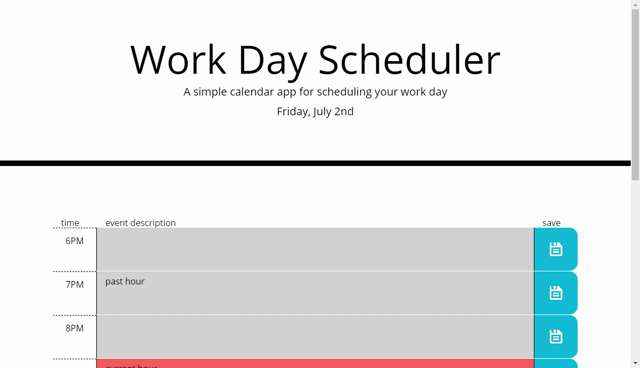

# Work Day Scheduler

deployment: https://brandonnorsworthy.github.io/uta-work-day-schduler/

### About
Calendar application that allows a user to save events for each hour of the day. This app runs in the browser and feature dynamically updated HTML and CSS powered by jQuery. Styled using the bootstrap framework also uses the Moment Library.

### Demo

  
**the white flashes are when the page gets refreshed**

### Functionality
* Generates the past 3 hours as well as 7 hours into the future to plan out the day
* dynamically creates ```<div class="row">``` as well as ```<div class="columns">```
* Styled using the [Bootstrap Framework](https://getbootstrap.com/)
* Stores users events in the DOMs local storage object so it can be loaded on page load.
* Gets accurate times using the [Moment.js Library](https://momentjs.com/)